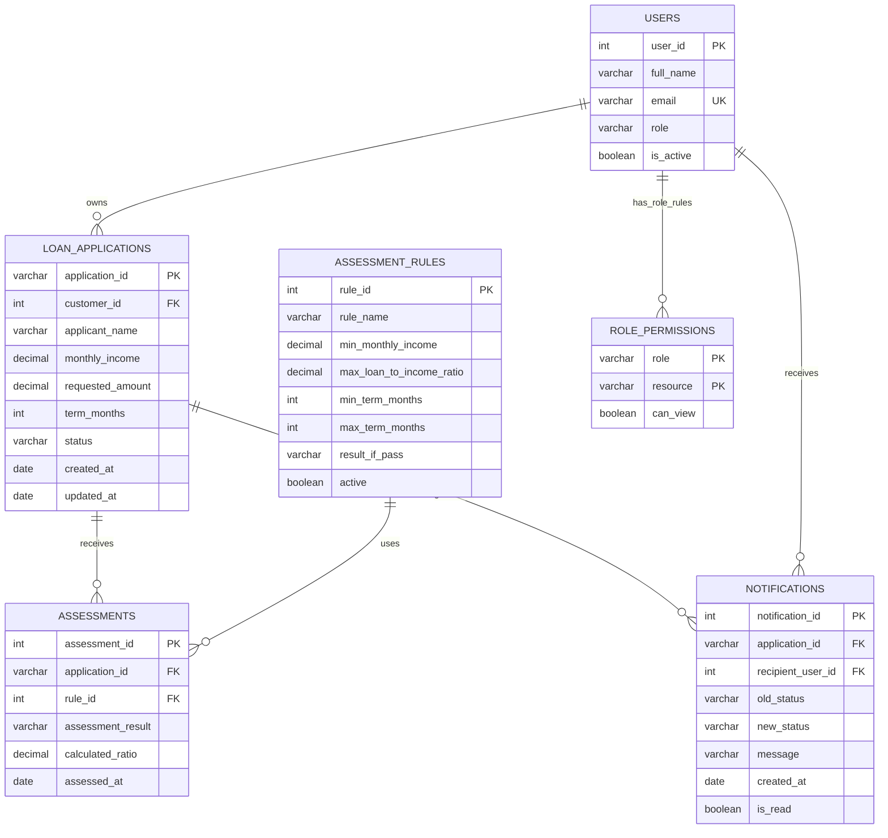

# LoanPulse — MVP Dataset Design

Project: **LoanPulse: LoanMaster Loan Management**

## 1. Purpose and scope

This design keeps disbursement information inside `loan_applications` because BR-06/TR-06 require disbursement status and date while the project is intentionally a simple individual-project MVP. A separate `disbursements` table is not required for the current scope.

This dataset design supports the LoanPulse MVP flow:

**Application data → rule-based assessment → customer status screen → manager decision report**

It also provides synthetic records for the current user stories and test cases, including the stretch/supporting stories for validation, authorization, notifications, and reproducibility.

**Data policy:** All records are synthetic. No real personal, financial, banking, government-ID, or contact data may be used.

## 2. Proposed relational tables

### 2.1 `users`

| Column | Type | Key | Null? | Description |
|---|---|---|---|---|
| user_id | INTEGER | PK | No | Unique application user identifier |
| full_name | VARCHAR(100) | | No | Synthetic display name |
| email | VARCHAR(150) | UNIQUE | No | Synthetic login email |
| role | VARCHAR(30) | | No | `CUSTOMER`, `LOAN_OFFICER`, or `LOAN_MANAGER` |
| is_active | BOOLEAN | | No | Whether the user can access the application |

### 2.2 `loan_applications`

| Column | Type | Key | Null? | Description |
|---|---|---|---|---|
| application_id | VARCHAR(20) | PK | No | Public application reference such as `APP-0001` |
| customer_id | INTEGER | FK → users.user_id | No | Applicant/customer owner |
| applicant_name | VARCHAR(100) | | No | Synthetic applicant name captured with the application |
| monthly_income | DECIMAL(12,2) | | No | Synthetic monthly income |
| requested_amount | DECIMAL(12,2) | | No | Requested loan amount |
| term_months | INTEGER | | No | Requested repayment term |
| status | VARCHAR(30) | | No | `DRAFT`, `PENDING_REVIEW`, `APPROVED`, `REJECTED`, `PENDING_MANAGER_REVIEW` |
| approved_amount | DECIMAL(12,2) | | Yes* | Positive amount for approved applications; otherwise NULL |
| disbursement_status | VARCHAR(30) | | No | `NOT_APPLICABLE`, `NOT_DISBURSED`, `DISBURSED` |
| disbursement_date | DATE | | Yes* | Stored for disbursed approved applications; otherwise NULL |
| created_at | DATE | | No | Synthetic application date |
| updated_at | DATE | | No | Synthetic last-update date |

### 2.3 `assessment_rules`

| Column | Type | Key | Null? | Description |
|---|---|---|---|---|
| rule_id | INTEGER | PK | No | Rule identifier |
| rule_name | VARCHAR(100) | | No | Human-readable rule name |
| min_monthly_income | DECIMAL(12,2) | | No | Minimum income threshold |
| max_loan_to_income_ratio | DECIMAL(6,2) | | No | Maximum requested amount divided by annual income |
| min_term_months | INTEGER | | No | Minimum permitted term |
| max_term_months | INTEGER | | No | Maximum permitted term |
| result_if_pass | VARCHAR(30) | | No | Result produced when configured conditions pass |
| active | BOOLEAN | | No | Whether the rule is currently used |

### 2.4 `assessments`

| Column | Type | Key | Null? | Description |
|---|---|---|---|---|
| assessment_id | INTEGER | PK | No | Assessment identifier |
| application_id | VARCHAR(20) | FK → loan_applications.application_id | No | Assessed application |
| rule_id | INTEGER | FK → assessment_rules.rule_id | No | Rule configuration used |
| assessment_result | VARCHAR(30) | | No | `ELIGIBLE` or `NOT_ELIGIBLE` |
| calculated_ratio | DECIMAL(8,2) | | No | Loan-to-annual-income ratio used by the rule |
| assessed_at | DATE | | No | Synthetic assessment date |

### 2.5 `notifications`

| Column | Type | Key | Null? | Description |
|---|---|---|---|---|
| notification_id | INTEGER | PK | No | Notification identifier |
| application_id | VARCHAR(20) | FK → loan_applications.application_id | No | Related application |
| recipient_user_id | INTEGER | FK → users.user_id | No | User receiving the update |
| old_status | VARCHAR(30) | | Yes | Previous status; null for first notification |
| new_status | VARCHAR(30) | | No | New application status |
| message | VARCHAR(255) | | No | Synthetic status-update text |
| created_at | DATE | | No | Synthetic notification date |
| is_read | BOOLEAN | | No | Whether the notification has been viewed |

### 2.6 `role_permissions`

| Column | Type | Key | Null? | Description |
|---|---|---|---|---|
| role | VARCHAR(30) | PK | No | Application role |
| resource | VARCHAR(50) | PK | No | Protected resource name |
| can_view | BOOLEAN | | No | Whether the role can view the resource |

## 3. ER diagram

## 4. Target row counts

The following is a small student-project dataset. It is large enough to exercise filters and reports without creating unnecessary data-management work.

| Table | Target rows | Purpose |
|---|---:|---|
| `users` | 12 | 6 customers, 4 loan officers, 2 loan managers |
| `loan_applications` | 40 | Main application dataset with mixed statuses |
| `assessment_rules` | 3 | Active and inactive rule configurations |
| `assessments` | 30 | Completed assessments for eligible/invalid/edge cases |
| `notifications` | 25 | Status-change records for notification tests |
| `role_permissions` | 6 | One row per role/resource combination needed for the demo |

Recommended status distribution for 40 applications:

- `DRAFT`: 5
- `PENDING_REVIEW`: 10
- `PENDING_MANAGER_REVIEW`: 8
- `APPROVED`: 8
- `REJECTED`: 9

## 5. Synthetic data generation rules

### 5.1 Customer/application patterns

- Use clearly synthetic names such as `Test Borrower 01` through `Test Borrower 06`.
- Use reserved-looking synthetic emails such as `borrower01@example.test`.
- Never use real phone numbers, addresses, Aadhaar numbers, PAN numbers, bank-account numbers, or real financial records.
- Each customer may own multiple applications so the report can demonstrate repeated borrowing activity.

### 5.2 Income distribution

Use a right-skewed distribution rather than perfectly uniform values:

- 60% of applications: monthly income ₹25,000–₹60,000
- 30%: ₹60,001–₹1,20,000
- 10%: ₹1,20,001–₹3,00,000

These are **synthetic generation ranges**, not claims about real borrowers.

### 5.3 Requested loan amounts

- Most applications: ₹50,000–₹4,00,000.
- A smaller group: ₹4,00,001–₹10,00,000.
- Include a few boundary values exactly at configured rule thresholds.
- Include one deliberately extreme synthetic outlier such as ₹50,00,000 to test validation/rule handling.

### 5.4 Terms

Use common synthetic term values such as 12, 18, 24, 36, and 60 months. Include values exactly at the minimum and maximum configured limits.

### 5.5 Status patterns

- Applications are distributed across the lifecycle rather than all having the same status.
- `PENDING_MANAGER_REVIEW` records should contain enough examples to make the manager report meaningful.
- Some records should have no assessment yet because they are still drafts or pending initial review.

### 5.6 Date patterns / seasonality

Use synthetic dates over approximately 12 months.

- Create modest monthly peaks around January, April, and October to make date grouping visible.
- Do not present these peaks as real lending seasonality; they exist only to make test/demo reports less uniform.

## 6. Deliberate edge cases and test-data mapping

Every current test case should have a corresponding synthetic record or fixture.

| Test case | Required data/fixture | Dataset location |
|---|---|---|
| TC-01 | Complete valid application | `APP-0001` |
| TC-02 | Missing monthly income | `APP-EDGE-NULL-INCOME` fixture |
| TC-03 | Existing `PENDING_REVIEW` application | `APP-0002` |
| TC-04 | Nonexistent ID `APP-9999` | Negative lookup; no row |
| TC-05 | Rule-eligible application | `APP-0003` |
| TC-06 | Negative income | `APP-EDGE-NEG-INCOME` fixture |
| TC-07 | Two applications with identical assessment inputs | `APP-0004`, `APP-0005` |
| TC-08 | Populated applicant and loan fields | `APP-0001` |
| TC-09 | Nonexistent application | `APP-9999` |
| TC-10 | Pending manager applications | `APP-0010` and `APP-0011` |
| TC-11 | Non-manager-review application | `APP-0002` |
| TC-12 | Approved loan with disbursement data | `APP-0015` |
| TC-13 | Disbursement date/status edge | `APP-EDGE-NO-DISBURSEMENT` fixture |
| TC-14 | Status change to `APPROVED` | `APP-0016` |
| TC-15 | No status change | `APP-0017` |
| TC-16 | Missing `loan_amount` | `APP-EDGE-NULL-AMOUNT` fixture |
| TC-17 | Non-numeric loan amount | `APP-EDGE-TEXT-AMOUNT` fixture |
| TC-18 | Authorized loan officer | `USER-LO-01` + `APP-0001` |
| TC-19 | Customer attempting protected staff record | `USER-CUST-01` + protected record |
| TC-20 | Clean repository/setup fixture | Repository + synthetic seed data |
| TC-21 | Documented test command | Repository + test suite |
| TC-22 | Multiple invalid/missing fields | Dedicated invalid fixture |
| TC-23 | Synthetic-only dataset scan | Entire seed dataset |
| TC-24 | Fresh environment | Repository + synthetic database seed |

## 7. Deliberate data-quality edge cases

Include these in a separate fixture set so normal demo records remain clean:

| Edge case | Example | Expected use |
|---|---|---|
| Null | `monthly_income = NULL` | Missing required-field validation |
| Null | `old_status = NULL` in first notification | Valid optional field case |
| Duplicate business input | Two applications with same income, amount, and term | Deterministic rule-result test |
| Duplicate identifier attempt | Reuse `APP-0001` during insert test | Primary-key rejection test |
| Negative outlier | `monthly_income = -5000` | Invalid input test |
| Extreme outlier | `requested_amount = 5000000` | Rule/validation boundary test |
| Text in numeric field | `requested_amount = 'abc'` | Format validation test |
| Boundary income | Exactly the minimum configured income | Rule-boundary test |
| Boundary ratio | Exactly the maximum configured ratio | Rule-boundary test |
| Missing application | `APP-9999` | Not-found test |
| Unauthorized access | Customer role requesting staff resource | Authorization test |
| No-op status update | Old status equals new status | Notification edge test |

## 8. MVP rule configuration

For a simple student implementation, use one active rule set rather than a complex scoring engine.

Example synthetic configuration:

- Minimum monthly income: **₹30,000**
- Maximum loan-to-annual-income ratio: **0.50**
- Minimum term: **12 months**
- Maximum term: **60 months**
- If all configured conditions pass → `ELIGIBLE`
- Otherwise → `NOT_ELIGIBLE`

These values are **project configuration examples**, not financial advice or real lending policy. They can be changed before implementation.

## 9. Data generation and reproducibility

- Generate seed data from a fixed random seed so the same dataset can be recreated.
- Keep the seed script in the repository, for example `scripts/seed_data.py`.
- Keep test fixtures separate from demonstration seed data where possible.
- Use deterministic IDs for the named edge-case records above.
- Store dates as ISO-formatted values (`YYYY-MM-DD`).
- Do not import external customer datasets.

## 10. MVP implementation recommendation

For the 10-day MVP, the minimum useful relational path is:

1. `users` — identify the customer and manager roles.
2. `loan_applications` — capture and retrieve application data.
3. `assessment_rules` — hold the configurable rule thresholds.
4. `assessments` — store deterministic rule results.

`notifications` and `role_permissions` support the stretch/standing stories and can be implemented after the core flow if time permits.
